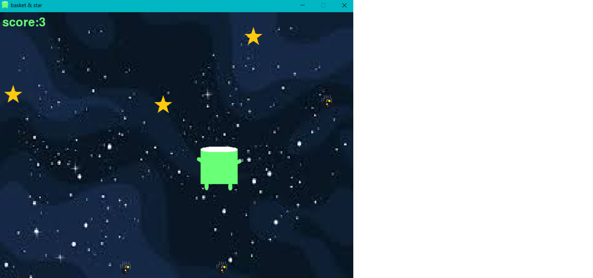

# Space Basket Catcher

A Python and Pygame arcade game where the player moves a basket to collect falling stars while avoiding falling bombs.

## Description

The game takes place in a space-themed environment. Multiple stars and bombs fall from the top of the screen at continuously updated positions.

The player must move the basket horizontally and catch as many stars as possible while avoiding bombs.

## Technologies

* Python
* Pygame

## Features

* Real-time basket movement
* Falling star objects
* Falling bomb objects
* Random object spawning
* Collision detection
* Dynamic score system
* Score penalties
* Level progression
* Game-over condition
* Space-themed visual environment
* Custom images and game icon

## Challenges

One of the main challenges of this project was managing multiple falling objects while detecting collisions with the basket.

Another challenge was creating score-based difficulty progression and handling the game-over state.

## What I Learned

Through this project, I learned how to:

* Build a game loop with Pygame
* Handle keyboard input
* Use collision detection
* Work with randomized object positions
* Track scores and game states
* Load and use image assets
* Create basic difficulty progression

## Status

Completed

## Future Improvements

* Add more types of falling objects
* Add more levels
* Add sound effects
* Add more advanced animations
* Add a high-score system

## Project Preview



The preview shows the Space Basket Catcher game during gameplay.

## Installation

Clone the repository:

```bash
git clone https://github.com/Genius-Progarmmer/Space-Basket-Catcher.git
```

Move into the project directory:

```bash
cd Space-Basket-Catcher
```

Install Pygame:

```bash
pip install pygame
```

## How to Run

Run the main Python file:

```bash
python main.py
```

## Project Structure

```text
Space-Basket-Catcher/
│
├── main.py
├── flappy_bird_preveiw.png
├── space.jpg
├── bomb.png
├── basket_green.png
└── star.png
```

## Programming Concepts

* Game loops
* Keyboard input
* Collision detection
* Randomized object positioning
* Object movement
* Lists and nested data
* Conditional statements
* Score tracking
* Game states
* Pygame rendering
* Asset loading

## Author

**Genius-Progarmmer**

GitHub: https://github.com/Genius-Progarmmer
